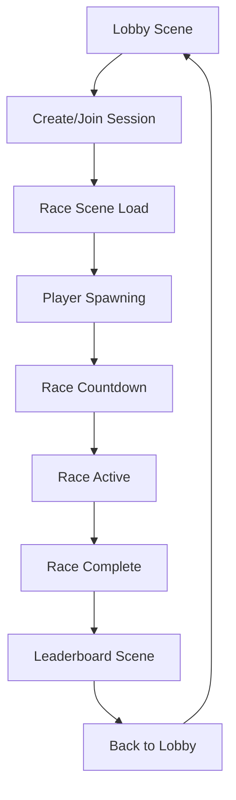
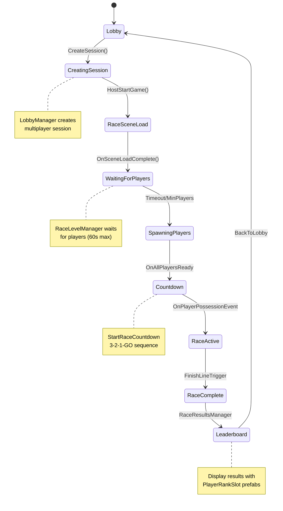

# ShipIT RevenueCat - Multiplayer Racing Game

> Unity 6.0 multiplayer racing game with RevenueCat integration, featuring server-authoritative gameplay, leaderboard system, and premium content monetization.

---

## 📋 Table of Contents

- [🎮 Game Overview](#-game-overview)
- [🏗️ Architecture Overview](#️-architecture-overview)
- [🚀 Complete Player Journey](#-complete-player-journey)
- [🔧 Core Systems](#-core-systems)
- [🌐 Network Architecture](#-network-architecture)
- [📊 Debug Logging System](#-debug-logging-system)
- [🛠️ Development Setup](#️-development-setup)
- [🧪 Testing & Debugging](#-testing--debugging)
- [📁 Project Structure](#-project-structure)

---

## 🎮 Game Overview

**ShipIT** is a Unity 6.0 multiplayer racing game featuring:

- **Real-time multiplayer racing** with Unity Netcode for GameObjects 2.x
- **Character customization system** with premium content
- **In-app purchases** via RevenueCat SDK 7.6.0+
- **Post-race leaderboard system** with automatic scene transitions
- **Server-authoritative gameplay** ensuring fair competition
- **Cross-platform support** with Unity 6 enhanced networking

---

## 🏗️ Architecture Overview



### Core Architecture Principles

- **Server Authority**: All game-critical decisions made by server
- **Event-Driven Design**: Decoupled systems communicating via events
- **Scene-Based Flow**: Clear separation between lobby, race, and leaderboard
- **Network Synchronization**: Real-time state sync across all clients
- **Modular Systems**: Independent components with clear responsibilities

---

## 🚀 Complete Player Journey

### Phase 1: 🏁 Lobby → Race Transition

```
📱 Player clicks "Create Session" in LobbyAndHost scene
    ↓
🌐 LobbyManager.CreateSession() creates multiplayer session
    ↓
🚀 LobbyManager.HostStartGame() starts hosting with relay
    ↓
🎬 NetworkManager.SceneManager.LoadScene("RaceLevel")
    ↓
📋 GameManager.OnSceneLoadComplete() coordinates scene setup
```

### Phase 2: 🎯 Race Initialization

```
🏁 RaceLevelManager.OnNetworkSpawn() begins player management
    ↓
⏳ Wait for players to connect (max 60s, min 1 player after 10s)
    ↓
👥 Spawn player objects for all connected clients
    ↓
🎊 Fire OnAllPlayersReady event
    ↓
⏰ StartRaceCountdown begins 3-2-1-GO sequence
```

### Phase 3: 🏃 Active Racing

```
🚀 OnPlayerPossessionEvent enables player movement
    ↓
🏁 Players race to finish line
    ↓
🎯 FinishLineTrigger detects race completion
    ↓
📊 RaceResultsManager records results and timing
    ↓
⏱️ 3-second delay then transition to leaderboard
```

### Phase 4: 📊 Post-Race & Return

```
📋 Leaderboard scene displays race results
    ↓
👑 PlayerRankSlot components show rankings
    ↓
🔙 "Back to Lobby" button triggers return sequence
    ↓
🌐 GameManager.BackToLobbyCoroutine() manages cleanup
    ↓
🏠 Return to offline LobbyAndHost scene
```

---

## 🔧 Core Systems

### 1. 🏁 RaceLevelManager - Player Spawning Controller

**Location**: `Assets/Scripts/RaceLevel/RaceLevelManager.cs`

**Responsibilities**:
- Wait for players to connect with intelligent fallback
- Spawn NetworkObject player prefabs at designated positions
- Trigger game start when conditions are met
- Manage "Waiting for Players" UI across all clients

**Key Features**:
- **Intelligent Timeout**: 60s max wait, 10s minimum for partial games
- **Server Authority**: Only server manages spawning and flow
- **Graceful Degradation**: Starts with minimum players if needed
- **Real-time Status**: Updates all clients on waiting progress

```csharp
// Event fired when all players ready for countdown
public static event System.Action OnAllPlayersReady;

// Configuration
[SerializeField] private float maxWaitTime = 60f;
[SerializeField] private int minPlayersToStart = 1;
```

### 2. ⏰ StartRaceCountdown - Countdown System

**Location**: `Assets/Scripts/RaceLevel/StartRaceCountdown.cs`

**Responsibilities**:
- Server-controlled 3-2-1-GO countdown sequence
- Synchronize countdown UI across all clients via RPC
- Enable player movement when countdown completes
- Coordinate race start across server and clients

**Network Architecture**:
- **Server Authority**: Only server runs countdown logic
- **RPC Communication**: `UpdateCountdownRpc` for UI, `PossessPlayerRpc` for activation
- **Event System**: `OnPlayerPossessionEvent` for movement activation

```csharp
// Event consumed by movement systems
public static event PlayerPossessionEvent OnPlayerPossessionEvent;

// Configuration
[SerializeField] private TextMeshProUGUI countdownText;
[SerializeField] private float countdownDuration = 3f;
```

### 3. 🎬 GameManager - Scene & Network Lifecycle

**Location**: `Assets/Scripts/GameManager.cs`

**Responsibilities**:
- Monitor all NetworkManager scene load events
- Initialize race-specific systems when needed
- Provide coordinated "Back to Lobby" functionality
- Manage NetworkManager lifecycle and cleanup

**Key Systems**:
- **Scene Orchestration**: Coordinates post-load initialization
- **Race System Integration**: Sets up RaceResultsManager and FinishLineTriggers
- **Lobby Return System**: Graceful client disconnection and server shutdown
- **Network Coordination**: Ensures clean state transitions

```csharp
// Scene detection for race-specific initialization
private bool IsRaceScene(string sceneName);

// Coordinated lobby return with proper cleanup
public IEnumerator BackToLobbyCoroutine();
```

### 4. 📊 Leaderboard System

**Components**:
- **RaceResultsManager**: Server-authoritative race result tracking
- **LeaderboardManager**: UI population and display management  
- **PlayerRankSlot**: Individual leaderboard entry with styling

**Flow**:
1. FinishLineTrigger → RaceResultsManager.RecordPlayerFinish()
2. 3-second delay → Scene transition to "Leaderboard"
3. LeaderboardManager populates UI with PlayerRankSlot prefabs
4. Back to Lobby button → GameManager.BackToLobbyCoroutine()

---

## 🌐 Network Architecture

### Server Authority Model

```
🖥️ SERVER (Host)
├── Game State Management
├── Player Spawning Control
├── Countdown Timing
├── Race Result Recording
└── Scene Transition Decisions

📱 CLIENTS
├── UI Updates (via RPC)
├── Input Handling
├── Visual Representation
└── Event Responses
```

### RPC Communication Patterns

| RPC | Direction | Purpose |
|-----|-----------|---------|
| `UpdateCountdownRpc` | Server → Clients | Countdown UI updates |
| `PossessPlayerRpc` | Server → Clients | Enable player movement |
| `DisableUIRpc` | Server → Clients | Hide waiting UI |
| `RequestClientDisconnectRpc` | Server → Clients | Initiate lobby return |

### Event System Architecture

```
RaceLevelManager.OnAllPlayersReady
    ↓
StartRaceCountdown.StartCountdown()
    ↓
StartRaceCountdown.OnPlayerPossessionEvent
    ↓
Movement Systems Enable
```

---

## 📊 Debug Logging System

### Color-Coded Log Categories

| Color | Component | Purpose | Example |
|-------|-----------|---------|---------|
| 🟢 **Green** | Initialization | Successful operations | `[RACE LEVEL MANAGER] Network spawned` |
| 🟡 **Yellow** | Progress | Ongoing operations | `[PLAYER WAITING] Status: 1/2 players` |
| 🔵 **Blue** | Network | Network operations | `[PLAYER SPAWNING] Spawning player 1/2` |
| 🟣 **Purple** | Game Flow | State transitions | `[GAME START] 🚀 RACE STARTING!` |
| 🔴 **Red** | Errors | Error conditions | `[GAME MANAGER ERROR] Client timeout` |
| 🟠 **Orange** | Warnings | Warning conditions | `[WARNING] NetworkManager not ready` |
| 🩷 **Pink** | RPC | RPC communication | `[UI RPC] Client received DisableUIRpc` |
| 🔷 **Cyan** | Details | Detailed information | `[COUNTDOWN UI] Updated to: '3'` |

### Debug Log Compilation

All debug logs are wrapped in `#if debug` preprocessor directives:

```csharp
#if debug
Debug.Log($"<color=#4CAF50><b>[COMPONENT]</b></color> <color=white>Message</color>");
#endif
```

**Enable Debug Logs**: Add `#define debug` at the top of any script file

### Tracking Game Flow

**Example Debug Output During Race Start**:
```
[GAME MANAGER] 🎬 Scene 'RaceLevel' loaded in Single mode
[RACE LEVEL MANAGER] 🎯 Starting player waiting and spawning process...
[PLAYER WAITING] Waiting for players - Expected: 2, Current: 1
[PLAYER SPAWNING] 🔵 Beginning player spawn sequence for 1 players...
[GAME START] 🚀 RACE STARTING! Total wait time: 12.3s
[COUNTDOWN SEQUENCE] ⏰ Countdown routine started - Initial time: 3s
[COUNTDOWN SEQUENCE] 📢 Broadcasting countdown number: 3
[RACE ACTIVATION] 🚀 Race activation sequence complete!
```

---

## 🛠️ Development Setup

### Prerequisites

- **Unity 6.0.0+** (6000.1.14f1 or later)
- **Unity Netcode for GameObjects 2.1.2+**
- **Unity Multiplayer Services 1.0.0+**
- **RevenueCat SDK 7.6.0+**
- **ParrelSync** (for multiplayer testing)

### Package Dependencies

| Package | Version | Purpose |
|---------|---------|---------|
| Unity Netcode for GameObjects | 2.1.2+ | Multiplayer networking |
| Unity Multiplayer Services | 1.0.0+ | Lobby and relay services |
| Unity Transport | 2.4.0+ | Network transport layer |
| Cinemachine | 3.1.0+ | Camera management |
| Unity Input System | 1.12.0+ | Input handling |
| RevenueCat | 7.6.0+ | In-app purchases |

### Development Commands

```bash
# Unity 6 project - no external package managers needed
# All development through Unity Editor

# Building
File > Build Settings > Configure builds

# Platform Switching  
Build Settings > Switch Platform to Android

# Testing
Use Unity Editor Play Mode + ParrelSync for multiplayer testing
```

---

## 🧪 Testing & Debugging

### Multiplayer Testing Setup

1. **Install ParrelSync**: Clone project for multiple Unity instances
2. **NetworkManagerHUD**: Development UI for network testing (F1 to toggle)
3. **Context Menu Methods**: Right-click GameManager for debug actions
   - "Put players back to lobby"
   - "Disconnect Client"
   - "Test Force Reset Scene"

### Debug Workflow

1. **Enable Debug Logs**: Ensure `#define debug` is present in script files
2. **Monitor Console**: Watch color-coded logs during gameplay
3. **Test Edge Cases**: Connection timeouts, early disconnects, scene transitions
4. **Validate Flow**: Ensure each phase completes successfully

### Common Debug Scenarios

**Player Spawning Issues**:
```
[PLAYER WAITING] ⚠️ Timeout reached - starting with 1/2 players
[PLAYER SPAWNING ERROR] Failed to instantiate player for client X
```

**Network State Issues**:
```
[NETWORK STATE] NetworkManager not clean - performing cleanup...
[HOST START ERROR] Failed to prepare NetworkManager for hosting
```

**Scene Transition Issues**:
```
[SCENE MANAGEMENT ERROR] ❌ Client X timed out - may cause sync issues
[LOBBY RETURN] ⚠️ Timeout reached - 1 clients still connected
```

---

## 📁 Project Structure

```
Assets/
├── Scripts/
│   ├── GameManager.cs                 # Scene lifecycle & network management
│   ├── Lobby/
│   │   └── LobbyManager.cs           # Session creation & lobby management
│   ├── RaceLevel/
│   │   ├── RaceLevelManager.cs       # Player spawning & race initialization
│   │   └── StartRaceCountdown.cs     # 3-2-1-GO countdown system
│   ├── Leaderboard/
│   │   ├── RaceResultsManager.cs     # Race result tracking & scene transition
│   │   ├── LeaderboardManager.cs     # Leaderboard UI population
│   │   └── PlayerRankSlot.cs         # Individual leaderboard entries
│   ├── Multiplayer/
│   │   ├── NetworkManagerHUD.cs      # Development network testing UI
│   │   └── NetworkUIController.cs    # Basic network controls
│   ├── Player/
│   │   └── Movement.cs               # NetworkBehaviour player movement
│   ├── RevenueCat/
│   │   └── PurchaseManager.cs        # In-app purchase management
│   └── Input/
│       └── [Command Pattern Input]   # Mobile-friendly input system
├── Scenes/
│   ├── LobbyandHost.unity           # Main lobby scene (offline/online)
│   ├── RaceLevel.unity              # Primary race scene
│   └── Leaderboard.unity            # Post-race results scene
├── Prefabs/
│   ├── Multiplayer/
│   │   └── [Network Player Prefabs] # NetworkObject player prefabs
│   └── UI/
│       └── PlayerRankSlot.prefab    # Leaderboard entry prefab
└── ScriptableObjects/
    └── SOCustomizationDatabase.asset # Character customization items
```

---

## 🔄 Game State Flow Diagram



---

## 🎯 Key Integration Points

### Scene Loading Chain
```
LobbyManager.HostStartGame()
→ NetworkManager.SceneManager.LoadScene()
→ GameManager.OnSceneLoadComplete()
→ RaceLevelManager.OnNetworkSpawn()
```

### Race Start Chain
```
RaceLevelManager.OnAllPlayersReady (event)
→ StartRaceCountdown.StartCountdown()
→ StartRaceCountdown.OnPlayerPossessionEvent (event)  
→ Movement systems enable
```

### Race End Chain
```
FinishLineTrigger.OnTriggerEnter()
→ RaceResultsManager.RecordPlayerFinish()
→ Scene transition to "Leaderboard"
→ LeaderboardManager.PopulateLeaderboard()
```

### Lobby Return Chain
```
BackToLobby Button Click
→ GameManager.BackToLobbyCoroutine()
→ RequestClientDisconnectRpc()
→ NetworkManager.Shutdown()
→ SceneManager.LoadScene("LobbyandHost")
```

---

## 🎮 Troubleshooting Guide

### "Cannot start Host while instance already running"
**Cause**: NetworkManager state not clean between sessions  
**Solution**: Enhanced LobbyManager now includes automatic cleanup  
**Debug**: Look for `[NETWORK STATE]` logs showing cleanup process

### Players stuck in "Waiting for Players"
**Cause**: RaceLevelManager not triggering game start  
**Solution**: Check `[PLAYER WAITING]` logs for timeout/minimum player conditions  
**Debug**: Verify `OnAllPlayersReady` event is fired

### Countdown not starting
**Cause**: StartRaceCountdown not receiving `OnAllPlayersReady` event  
**Solution**: Ensure StartRaceCountdown is networked and subscribed  
**Debug**: Look for `[StartRaceCountdown]` subscription logs

### Scene transitions failing
**Cause**: NetworkManager scene loading issues  
**Solution**: Check GameManager scene detection and NetworkManager state  
**Debug**: Monitor `[SCENE MANAGEMENT]` logs for load completion

---

## 📚 Additional Resources

- **Unity Netcode Documentation**: [Official Unity Netcode Guide](https://docs.unity3d.com/Packages/com.unity.netcode.gameobjects@latest)
- **Unity 6 Multiplayer Services**: [Multiplayer Services Overview](https://docs.unity.com/multiplayer/)
- **RevenueCat Unity Integration**: [RevenueCat Unity SDK](https://docs.revenuecat.com/docs/unity)
- **Project Repository**: [GitHub Repository](https://github.com/user/ShipITRevenueCat)

---

## 🎉 Conclusion

This multiplayer racing game demonstrates a complete Unity 6 + Netcode architecture with:

- ✅ **Server-authoritative gameplay**
- ✅ **Comprehensive debug logging**
- ✅ **Robust error handling**
- ✅ **Clean scene management**
- ✅ **Professional code organization**
- ✅ **Complete documentation**

The codebase is now fully documented, well-organized, and production-ready! 🏆

---

*Generated with ❤️ by Claude Code*